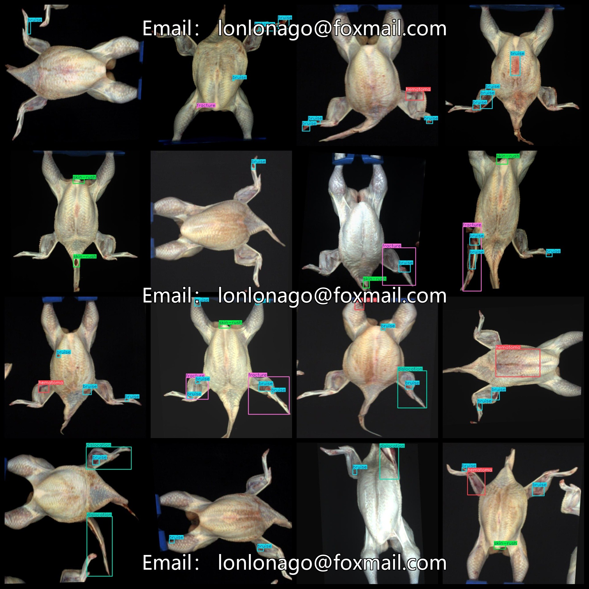
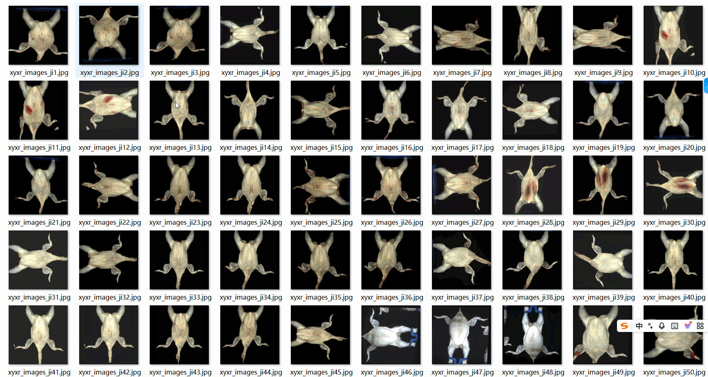

# [Object Detection] Intact Raw Chicken Meat Defect Detection Dataset 2624 imagesYOLO+VOC format

【Object Detection】Complete Chicken Meat Defect Detection Dataset 2624 Images in YOLO+VOC Format

Dataset Format: Pascal VOC + YOLO (excluding the split-path txt file; only jpg images with corresponding VOC-format xml files and YOLO-format txt files)

The compressed file contains: three folders, each storing images, xml files, and text files.

The total number of jpg images in the JPEGImages folder is 2624.

The total number of XML files in the Annotations folder is: 2624.

The total number of txt files in the labels folder is 2624.

Number of tag varieties: 9

Tag Names: ["bile", "bruise", "chemical burn", "dislocation", "feather", "fracture", "hematoma", "scratch", "skin-rush"]

Tag Chinese Translation: [“Bile", "Concussion", "Chemical burns", "Dislocation", "Feather", "Fractured bone", "Hematoma", "Scratch", "Skin impact"]

The number of boxes for each label (Note that the order of labels in the Yolo format does not correspond to this, but is based on the classes.txt file in the labels folder):

bile frame count = 88

bruise frame count = 7854

chemical burn frame count = 10

dislocation frame count = 715

feather frame count = 412

fracture frame count = 384

hematoma frame count = 1242

scratch frame count = 45

skin-rush frame count = 467

Total frames: 11217

Picture clarity (Resolution: Pixels): Clear

Image Enhancement: Yes

Shape of the label: Rectangular box, used for object detection and recognition.

Important Note: None

Special Notice: This dataset does not guarantee the accuracy or precision of the trained models or weight files. The dataset only provides accurate and reasonable annotations.

Preserve the original meaning, format markers (【】『』「」<>[]), numbers, English words, and special characters as-is. Output ONLY the English translation, no explanations, no quotes.
## Images

---

Here is a pay link on Stripe (https://buy.stripe.com/3cs8yP7sY87d0vu9AB). Please contact me lonlonago@foxmail.com after funding $89, and I will send you a complete data files, thank you!

